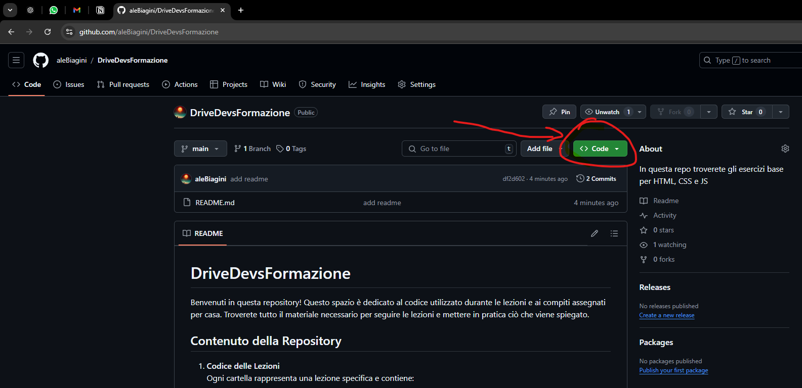

# DriveDevsFormazione
Benvenuti in questa repository! Questo spazio è dedicato al codice utilizzato durante le lezioni e ai compiti assegnati per casa. Troverete tutto il materiale necessario per seguire le lezioni e mettere in pratica ciò che viene spiegato.

## Contenuto della Repository

1. **Codice delle Lezioni**  
   Ogni cartella rappresenta una lezione specifica e contiene:
   - Esempi di codice spiegati durante la lezione.
   - Eventuali esercizi svolti in aula.

2. **Compiti per Casa**  
   I compiti assegnati sono organizzati in cartelle specifiche, con:
   - Descrizioni dettagliate degli esercizi.
   - File di esempio o di partenza per aiutarvi a iniziare.

## Come Usare Questa Repository

Per accedere al codice e ai materiali, segui questi semplici passaggi:

### 1. Scaricare il Codice

Hai due opzioni per scaricare i file della repository:

#### Opzione 1: Scaricare un file ZIP

1. Clicca sul pulsante verde **Code** nella parte superiore della pagina.
2. Seleziona **Download ZIP** dal menu a tendina.
3. Una volta scaricato, estrai il file ZIP in una cartella sul tuo computer.



#### Opzione 2: Clonare la repository con Git

Se preferisci usare Git (consigliato per chi ha familiarità con il terminale), puoi clonare la repository sul tuo computer. Ecco come fare:

1. Copia l'URL della repository cliccando su **Code** e poi sul pulsante accanto all'URL.
2. Apri il terminale (o il prompt dei comandi) sul tuo computer.
3. Esegui il seguente comando per clonare la repository nella tua macchina locale:
   ```bash
   git clone <URL-della-repository>
Sostituisci <URL-della-repository> con l'indirizzo della repository (esempio: https://github.com/username/nome-repository.git).

